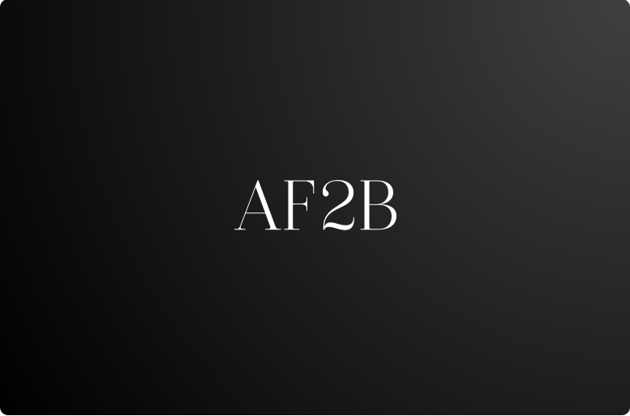

 

  

  <h3 align="center">Projetos</h3>

    

## Sobre o Repositório

Este repositório consiste em armazenar meus projetos pessoais.

## Tecnologias atuais contidas

- Angular
- Ionic
- Swing
- Flutter
- Nextjs
- React
